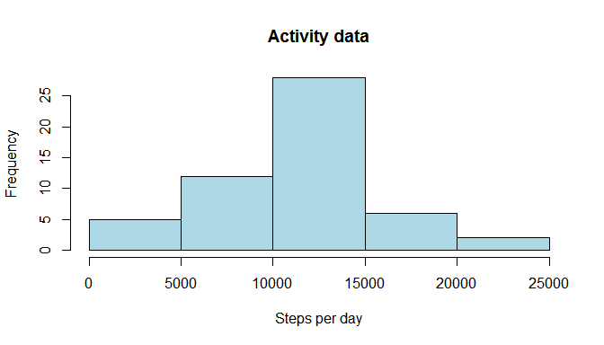
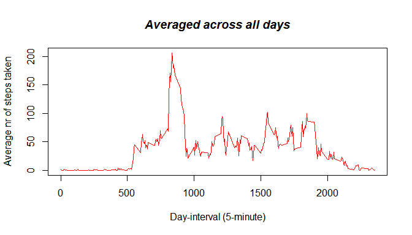
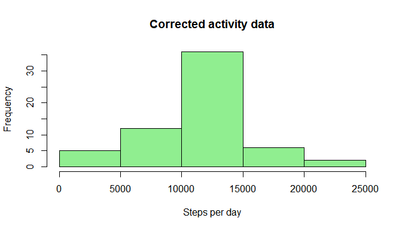
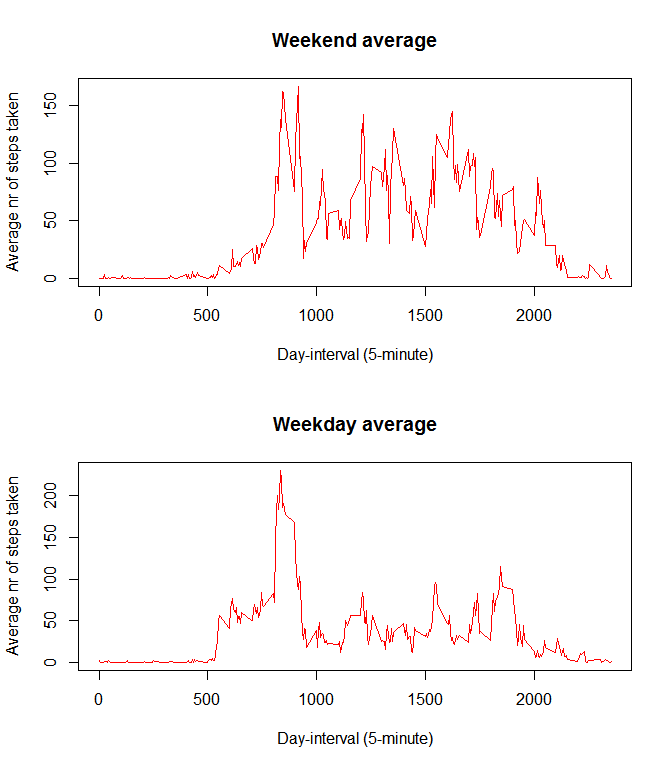

# Reproducible Research: Peer Assessment 1
HvdR  
Saturday, July 18, 2015  

## a) Introduction

This document describes the analysis of the data about personal 
movement during the months of October and November, 2012.

## b) Loading and preprocessing the data
The dataset is copied from 
https://d396qusza40orc.cloudfront.net/repdata%2Fdata%2Factivity.zip to "activity.zip". The data is read in with:

```r
activity1 <- read.csv(unz("activity.zip", "activity.csv"))
```
The data consists of: 

- date: the date of the measurement
- interval: the 5-minute interval of the day
- steps: the number of steps taken in the 5-minute interval

## c) What is mean total number of steps taken per day?
The total number of steps taken per day is calculated with:

```r
stepsperday1 <- aggregate(steps ~ date, data = activity1, sum)
```
The histogram of the total steps taken per day is:

```r
hist(stepsperday1$steps, 
     col="lightblue", 
     main="Activity data",
     xlab="Steps per day",
     ylab="Frequency")
```

 

Calculating the mean and median of the total number of steps taken per day is done with the summary function:


```r
summarystepsperday1 <- summary(stepsperday1$steps)
daymedian1 <- as.integer(summarystepsperday1["Median"])
daymean1 <- as.integer(summarystepsperday1["Mean"])
daytotal1 <- as.integer(sum(stepsperday1$steps, na.rm=TRUE))
```

The mean and median of the total number of steps taken per 
day is:

- Mean: **10770**.
- Median: **10760**.


## d) What is the average daily activity pattern?

The average daily activity pattern consists of the mean of 
each 5-minute interval accross all days in the dataset.

The calculation is done with:


```r
stepsperinterval1 <- aggregate(steps ~ interval, data = activity1, mean )
```

The plotting is: 

```r
plot(stepsperinterval1$interval, 
     stepsperinterval1$steps, 
     xlab= "Day-interval (5-minute)", 
     ylab= "Average nr of steps taken", 
     type='l', 
     col='red')
title(main="Averaged across all days", 
      col.main="black", 
      font.main=4)
```

 

The 5-minute interval accross all days with the maximum mean value is caculated with:


```r
intervalmax1 <- (stepsperinterval1[ 
   stepsperinterval1$steps == max( stepsperinterval1$steps),1 ])
```

The 5-minute interval accross all days with the maximum mean value is: 

- Interval with maximum mean: **835 **.

## e) Imputing missing values

Calculating the total number of missing values in the dataset:


```r
missingvalues <- sum(is.na(activity1$steps))
totalvalues <- nrow(activity1)
```

The missing and total number of values is:

- Total number of values: **17568**.
- Number of missing values: **2304**.

The strategy for filling in all of the missing values is:
*calculate the rounded mean of the 5-minute interval of the other days*. 


```r
replacena <- function(x,interval) {
  if (is.na(x))
    round(stepsperinterval1[
      stepsperinterval1$interval == interval,][,2])
  else
    x
}
```

Creating a new dataset with missing data filled in:

```r
# copy dataset
activity2 <- activity1
# repalce na's
activity2$steps <- mapply(replacena,
                          activity2$steps,activity2$interval)
```

Showing the histogram with missing data filled in:

```r
# the histogram of the date with missing data filled
hist(stepsperday2$steps, 
     col="lightgreen", 
     main="Corrected activity data",
     xlab="Steps per day",
     ylab="Frequency")
```

 

Calculation of the new median and mean values:

```r
summarystepsperday2 <- summary(stepsperday2$steps)
daymedian2 <- as.integer(summarystepsperday2["Median"])
daymean2 <- as.integer(summarystepsperday2["Mean"])
daytotal2 <- as.integer(sum(stepsperday2$steps))
```

The mean and median of the total number of steps taken per 
day with the missing values filled in is:

- Mean: **10770**.
- Median: **10760**.

### Consequences of filling in the missing values

- The "Mean" and "Median" values don't change: 
using the mean values of the other days doesn't 
disturb the distribution

- The "Total" values of the do change from 
original **570608** to **656704**:
replacing missing values with mean values results
in more steps.


## f) Are there differences in activity patterns between weekdays and weekends?

The function which creates a new factor variable 
with values: "weekday and "weekend":


```r
makeweekfactor <- function(datestr) {
  aday <- as.Date(datestr)
  wday <- weekdays(aday,abbreviate=TRUE)
  if (wday == "za" || wday == "zo") { 
    1
  } else { 
    0
  }
}
```


Adding the new factor variable to the dataset:


```r
activity2$day <- sapply(activity2$date,makeweekfactor)
activity2$day <- factor(activity2$day,
                        labels = c("weekday","weekend"))
```

Creation of the dataset with the average steps per interval,
averaged for the factor weekday or weekend:


```r
stepsperinterval2 <- aggregate(steps ~ interval + day, 
    data = activity2, mean )
```

Plotting the time series plot of the 5-minute interval
and the average number of steps taken, averaged 
across all weekday days or weekend days:


```r
# 2 rows of diagrams
par(mfrow = c(2,1))
# the weekend average
plot(subset(stepsperinterval2,day=="weekend")$interval, 
     subset(stepsperinterval2,day=="weekend")$steps, 
     xlab= "Day-interval (5-minute)", 
     ylab= "Average nr of steps taken", 
     main="Weekend average",
     type='l', 
     col='red')
# the weekday average
plot(subset(stepsperinterval2,day=="weekday")$interval, 
     subset(stepsperinterval2,day=="weekday")$steps, 
     xlab= "Day-interval (5-minute)", 
     ylab= "Average nr of steps taken", 
     main="Weekday average",
     type='l', 
     col='red')
```

 
